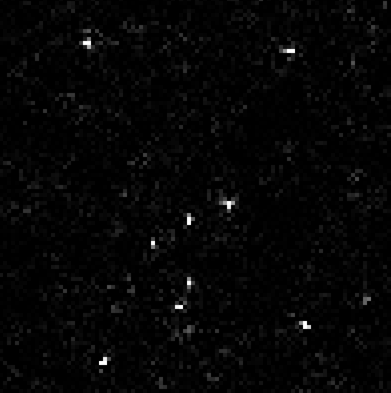

# Star Fizzle
A simple non-deterministic cellular automata with remarkable properties

General formula:

`nws[i][j] += trans * ((wa + wb) / 2 - sin(ws[i][j] * freq * tau()))`

A common used setting is `trans = 0.4` and `freq = 0.77`.

### How to use the script

1. Install [Rust](https://www.rust-lang.org/) if you have not.

2. Install Dyon-Interactive:

`cargo install piston-dyon_interactive --example dyongame`

3. Run the script:

`dyongame src/main.dyon`

Adds stars using the mouse (point-and-click).

- If the star is too big, a super-nova will be created that consumes the entire map
- The map is automatically reset after a supernova
- You can cancel supernovas (or stars) by clicking on them

### Properties

The stability is very sensitive depending on `trans` and `freq`.
